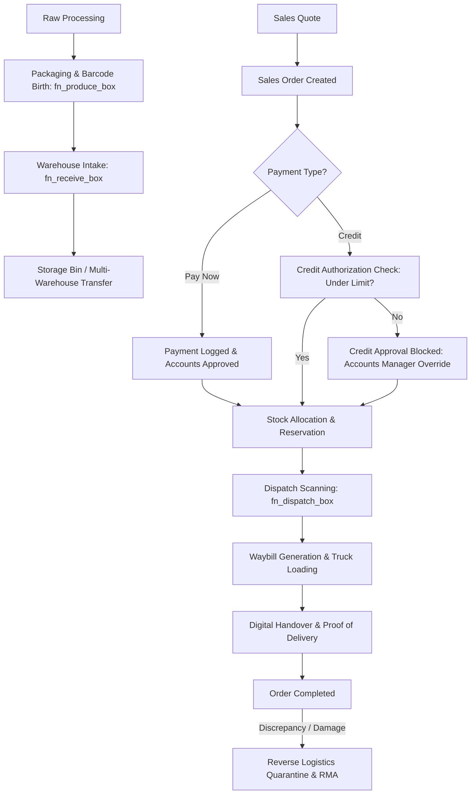

# Two Brothers Food Complex (2BF) — Enterprise Operations & System Architecture Manual

```
  ██████╗ ██████╗ ███████╗   ███████╗██████╗ ██████╗ 
  ╚════██╗██╔══██╗██╔════╝   ██╔════╝██╔══██╗██╔══██╗
   █████╔╝██████╔╝█████╗     █████╗  ██████╔╝██████╔╝
  ██╔═══╝ ██╔══██╗██╔══╝     ██╔══╝  ██╔══██╗██╔═══╝ 
  ███████╗██████╔╝██║        ███████╗██║  ██║██║     
  ╚══════╝╚═════╝ ╚═╝        ╚══════╝╚═╝  ╚═╝╚═╝     
   FOOD COMPLEX P.L.C. • OPERATIONS & TRACEABILITY MANUAL
```

---

# Table of Contents
1. [Executive Summary & Enterprise Overview](#chapter-1-executive-summary--enterprise-overview)
2. [System Architecture & Technology Stack](#chapter-2-system-architecture--technology-stack)
3. [Security Model, RBAC & The 17 Enterprise Roles](#chapter-3-security-model-rbac--the-17-enterprise-roles)
4. [The End-to-End Factory Lifecycle ("Grain to Gate")](#chapter-4-the-end-to-end-factory-lifecycle-grain-to-gate)
   - 4.1 Production Floor & Barcode Serialization
   - 4.2 Warehouse Intake, Storage & Internal Transfers
   - 4.3 Sales Quotations, Dynamic Pricing & Discount Approvals
   - 4.4 Accounts Receivable, Credit Limits & Payment Approval
   - 4.5 Order Fulfillment & Stock Reservation
   - 4.6 Dispatch Staging, Barcode Scanning & Waybill Generation
   - 4.7 Delivery, Fleet Routing & Digital Proof-of-Delivery Handover
   - 4.8 Reverse Logistics, Quarantine & Returns Processing
5. [The Traceability Engine: Barcode Passport System](#chapter-5-the-traceability-engine-barcode-passport-system)
6. [Industrial Hardware Integration, Offline Queue & PWA](#chapter-6-industrial-hardware-integration-offline-queue--pwa)
7. [Executive Intelligence, Shift Handovers & Reporting](#chapter-7-executive-intelligence-shift-handovers--reporting)
8. [Database Topology, Stored Procedures & RLS Policies](#chapter-8-database-topology-stored-procedures--rls-policies)
9. [System Administration, User Lifecycle & Audit Compliance](#chapter-9-system-administration-user-lifecycle--audit-compliance)
10. [Resilience, Fail-Safes & Production Runbook](#chapter-10-resilience-fail-safes--production-runbook)

---

# Chapter 1: Executive Summary & Enterprise Overview

**Two Brothers Food Complex P.L.C. (2BF)** operates large-scale commercial food processing facilities in East Africa. In commercial food manufacturing, operating margins depend critically on three factors:
1. **Zero Inventory Leakage**: Real-time matching between physical cartons produced and inventory billed.
2. **Defensible Quality Traceability**: Ability to isolate any carton, production batch, or raw material lot within seconds.
3. **Credit Risk Mitigation**: Ensuring high-volume commercial wholesale buyers do not receive dispatches exceeding verified collateral or credit limits.

The **2BF Enterprise Resource Planning (ERP) & Warehouse Management System (WMS)** was engineered specifically to solve these challenges without the bloated overhead or brittle downtime of generic legacy ERP software.

### Core System Philosophy
- **Physical-to-Digital Truth**: A box cannot exist in a warehouse unless it was scanned off the production line. A box cannot leave the loading dock unless its barcode matches an approved, credit-cleared customer order.
- **Fail-Safe Offline Autonomy**: High-speed packaging lines cannot halt if internet connectivity drops. The system buffers scans and synchronizes bidirectionally when connectivity restores.
- **Non-Repudiation**: Every state mutation (production scan, bin transfer, credit limit override, delivery signature) is cryptographically or auditorially logged with operator identity, timestamp, and hardware fingerprint.

---

# Chapter 2: System Architecture & Technology Stack

```
+-------------------------------------------------------------------------------+
|                             CLIENT INTERFACES                                 |
|  [Desktop Admin / Web]      [Rugged Android Scanners]     [Tablet Waybills]   |
|  Tailwind + Radix UI        PWA Offline Service Worker    HTML5 Canvas Sign   |
+-------------------------------------------------------------------------------+
                                      |  HTTPS / WebSocket
+-------------------------------------------------------------------------------+
|                      NEXT.JS 13.5 APP ROUTER GATEWAY                          |
|  - AppShell Layout Isolation         - Client-Side Role ACL Guard             |
|  - Server-Side API Handlers          - Dynamic Serverless Execution           |
|  - PDF Vector Engine (jspdf)         - Realtime Channel Subscriptions         |
+-------------------------------------------------------------------------------+
                                      |  TLS (PostgreSQL Wire / REST)
+-------------------------------------------------------------------------------+
|                      SUPABASE POSTGRESQL ENTERPRISE CORE                      |
|  - Row Level Security (RLS)          - ACID Atomic Stored Procedures (RPCs)   |
|  - Realtime Changefeed PubSub        - Storage Bucket Proof-of-Payments       |
|  - Audit Log Event Triggers          - Multi-Warehouse Partitioning           |
+-------------------------------------------------------------------------------+
```

### Architectural Pillars
1. **Frontend Presentation**: Next.js 13.5 utilizing the App Router with React 18 and Tailwind CSS. Built with an industrial design system featuring 8px enterprise border radii, clean contrast ratios for factory floor visibility, and dark/light mode toggle.
2. **Hardware Wedge Layer**: Embedded keyboard wedge listener that intercepts high-frequency keystrokes from physical laser/CCD barcode scanners (`hooks/use-keyboard-wedge.ts`) while filtering manual keyboard typists.
3. **State Engine**: PostgreSQL stored procedures executing atomic state transitions within `BEGIN...COMMIT` blocks. This ensures that concurrent scanners at multiple loading docks never double-dispatch the same carton.
4. **Offline Resilience**: A Progressive Web App (PWA) backed by `public/sw.js` and IndexedDB queues to guarantee zero data loss during network blackouts.

---

# Chapter 3: Security Model, RBAC & The 17 Enterprise Roles

The system implements a granular **Role-Based Access Control (RBAC)** architecture. Every user profile is mapped to an authoritative `role` within the `profiles` table.

```
                                  [ ADMIN ]
                                      |
         +----------------------------+----------------------------+
         |                            |                            |
   [ PRODUCTION ]              [ WAREHOUSE ]                  [ SALES ]
   - production                 - warehouse                   - sales
   - production_manager         - warehouse_manager           - sales_manager
         |                            |                            |
         |                     [ DISPATCH ]                 [ ACCOUNTS ]
         |                     - dispatch                   - accounts
         |                     - dispatch_manager           - accounts_manager
         |                            |                            |
         +----------------------------+----------------------------+
                                      |
                       [ LOGISTICS, QUALITY & AUDIT ]
                       - delivery
                       - returns / returns_manager
                       - reports (read-only auditor)
                       - manager (executive supervisor)
```

### Role Authorization Matrix

| Role Key | Human Title | Allowed Scopes & Privileges | Restricted Actions |
| :--- | :--- | :--- | :--- |
| `admin` | System Administrator | Full access to users, system parameters, audit logs, and security | Cannot bypass database foreign keys |
| `production` | Packaging Operator | Scan newly produced boxes, register batch/lot codes | Cannot receive into warehouse or dispatch |
| `production_manager`| Production Supervisor| Production floor oversight, approve scrap/correction logs | Cannot modify accounts or customer balances |
| `warehouse` | Warehouse Receiver | Receive cartons into inventory, execute internal transfers | Cannot create customer orders or dispatch |
| `warehouse_manager` | Warehouse Manager | Manage warehouse locations, approve stock reconciliation | Cannot alter product base pricing |
| `dispatch` | Loading Dock Clerk | Scan cartons for customer order dispatch, verify waybills | Cannot approve orders without credit clearance |
| `dispatch_manager` | Dispatch Supervisor | Gatekeeper for vehicle releases, approve loading discrepancies | Cannot authorize credit limits |
| `sales` | Sales Representative| Create customer profiles, draft orders and quotations | Cannot approve discounts or override credit |
| `sales_manager` | Sales Director | Approve sales discounts, view commercial pipelines | Cannot register financial payments |
| `accounts` | Finance Officer | Log incoming customer payments, review debt aging | Cannot approve customer credit limits |
| `accounts_manager` | Chief Financial Officer | Authorize customer credit limits, approve payment waivers | Cannot dispatch stock |
| `delivery` | Fleet Driver / 3PL | View assigned manifests, capture recipient digital signatures | Cannot edit order line items |
| `returns` | RMA Clerk | Intake returned or damaged goods into quarantine | Cannot return damaged stock to active inventory |
| `returns_manager` | Quality Assurance Lead | Inspect quarantined goods, authorize write-off or restock | Cannot create sales orders |
| `reports` | Financial Auditor | Read-only access to all reports, audit logs, and analytics | Zero write permissions (enforced by RLS) |

---

# Chapter 4: The End-to-End Factory Lifecycle ("Grain to Gate")

The factory operates on a strict linear state progression for every unit of production.



### 4.1 Production Floor & Barcode Serialization
1. Each packaging line generates serialized barcodes (e.g. `2BF-PRD-20260904-XXXXX`).
2. Packaging operators use optical laser scanners connected to the **Production Terminal** (`/production`).
3. The operator selects the active SKU (e.g., *Biscuits 500g*, *Pasta 1kg*) and lot number.
4. Calling `fn_produce_box`:
   - Validates that the barcode is globally unique.
   - Inserts record into `boxes` with `status = 'produced'`.
   - Records production timestamp, user ID, and batch metadata.

### 4.2 Warehouse Intake, Storage & Internal Transfers
1. Pallets transfer from the packaging floor to the warehouse intake bay (`/warehouse`).
2. The warehouse receiver scans each carton.
3. The system executes `fn_receive_box`:
   - Verifies the carton is currently in `produced` or `in_transit` state.
   - Transitions `status` to `in_stock`.
   - Associates the box with the receiving `warehouse_id`.
4. If goods move between regional warehouses (e.g. *Central Plant* to *Addis Distribution Hub*), an internal transfer order is registered, transitioning stock through an `in_transit` custody state.

### 4.3 Sales Quotations, Dynamic Pricing & Discount Approvals
1. Sales representatives (`/orders` or `/quote`) draft commercial orders.
2. Prices are resolved dynamically from the `product_prices` table using the effective date matrix (`effective_from <= NOW() AND (effective_to IS NULL OR effective_to >= NOW())`).
3. If a special customer discount is requested:
   - The order enters `discount_pending` state.
   - A high-priority notification routes to the **Sales Manager** (`/approvals`).
   - The Sales Manager reviews profit margins before executing `fn_approve_discount`.

### 4.4 Accounts Receivable, Credit Limits & Payment Approval
The system enforces strict credit control to protect factory cash flow:
1. **Pre-Paid Orders (`pay_now`)**:
   - The sales clerk submits proof of bank deposit or cash receipt (`/account/payments`).
   - The Accounts Officer verifies the transaction and approves the payment.
   - Once `paid_amount >= total_amount`, the order automatically unlocks for fulfillment.
2. **Credit Orders (`credit`)**:
   - The customer's active balance is checked against `customer_credit_settings.credit_limit`.
   - If `current_debt + order_total <= credit_limit`, the order passes automated credit verification.
   - If the order breaches the limit, it is placed on **Credit Hold** until an `accounts_manager` executes an authorization override.

### 4.5 Order Fulfillment & Stock Reservation
1. Once cleared by Finance, the order enters the **Fulfillment Engine** (`/warehouse/fulfillment`).
2. The system checks available unreserved stock of the requested SKUs in the designated fulfillment warehouse.
3. Inventory is allocated following **FIFO (First-In, First-Out)** principles based on production date to minimize expiration risk.

### 4.6 Dispatch Staging, Barcode Scanning & Waybill Generation
1. At the loading dock, loading crews open the **Dispatch Portal** (`/dispatch`).
2. Operators scan each physical carton loaded into the vehicle.
3. The backend executes `fn_dispatch_box`:
   - Validates that the scanned barcode is currently `in_stock` in that warehouse.
   - Verifies the SKU belongs to the active order.
   - Decrements order remaining quantity.
   - Updates `boxes.status` to `dispatched`.
4. When all cartons are loaded, the system automatically generates an official **2BF Dispatch Waybill & Packing Slip** with vehicle plate number, driver identity, total carton count, and weight.

### 4.7 Delivery, Fleet Routing & Digital Proof-of-Delivery Handover
1. Upon vehicle arrival at the customer depot, the handover interface (`/handover`) is launched on a mobile tablet.
2. The recipient's details are documented:
   - Recipient Type: Customer Principal, Authorized Representative, or 3PL Transporter.
   - Full Name, Phone Number, and Government ID Number.
3. The recipient reviews the carton count and signs directly on the touch screen via HTML5 vector canvas.
4. The cryptographic data URL signature is attached to the permanent handover manifest, sealing the order as `handed_over` / `delivered`.

### 4.8 Reverse Logistics, Quarantine & Returns Processing
1. If cartons arrive damaged, expired, or rejected, the RMA process begins (`/returns`).
2. Goods are received into a segregated **Quarantine Virtual Warehouse**.
3. A Quality Assurance Inspector conducts a physical inspection:
   - **Approved Return**: Cartons are returned to active stock via `fn_process_return`.
   - **Write-Off / Scrap**: Cartons are marked destroyed and removed from financial asset ledgers.

---

# Chapter 5: The Traceability Engine: Barcode Passport System

The **Barcode Passport** (`/barcode-passport`) is the flagship quality assurance tool of 2BF. Entering or scanning any barcode generates an immutable, chronological passport of that physical item:

```
[BOX BARCODE PASSPORT: 2BF-BOX-98412]
--------------------------------------------------------------------------------
1. BIRTH:      2026-08-14 06:22:10 EAT | Operator: Abebe K. | Line 2 (Packaging)
   Batch/Lot:  LOT-2026-B4 | SKU: Biscuits 500g Value Pack
2. INTAKE:     2026-08-14 07:15:30 EAT | Receiver: Dawit M. | Warehouse: Central Bay 4
3. TRANSFER:   2026-08-16 11:04:12 EAT | Transit Waybill: TR-884 | To: Hawassa Hub
4. RECEIPT:    2026-08-16 16:45:00 EAT | Receiver: Tigist G. | Warehouse: Hawassa Hub
5. ALLOCATION: 2026-08-18 09:12:00 EAT | Order: SO-2026-0492 | Customer: Omega Supermarket
6. DISPATCH:   2026-08-18 14:30:15 EAT | Loader: Solomon B. | Truck: ET-3-92144
7. HANDOVER:   2026-08-19 10:11:42 EAT | Signed by: Kebede T. (National ID: 09218)
--------------------------------------------------------------------------------
STATUS: DELIVERED • INTEGRITY: 100% AUDIT COMPLIANT
```

This level of granularity allows 2BF to:
- Trace consumer feedback back to the specific machine operator and shift.
- Prove non-involvement in counterfeit product claims.
- Satisfy regulatory compliance audits (e.g. Ethiopian FDA, ISO 22000 Food Safety Standards).

---

# Chapter 6: Industrial Hardware Integration, Offline Queue & PWA

Factory environments present unique physical constraints: moisture, vibration, spotty Wi-Fi, and the necessity of wearing gloves.

### 1. High-Speed Laser/CCD Wedge Handler
- Physical Bluetooth/USB scanners emulate keyboard keystroke bursts terminating with an `Enter` key.
- `hooks/use-keyboard-wedge.ts` captures characters arriving within a sub-50ms window.
- The hook prevents native browser form focus loss and emits an immediate event to the active scanning workflow, allowing continuous scanning at speeds up to 120 cartons per minute.

### 2. Camera Optical Scanner Fallback
- For managers or field delivery drivers without laser guns, the system provides an integrated camera scanner (`components/scanner/CameraScanner.tsx`) utilizing ZXing barcode algorithms with torch/flash toggle.

### 3. Progressive Web App (PWA) Offline Engine
- Service worker (`public/sw.js`) caches app shells, CSS, icons, and product catalogs.
- If connectivity is severed while a driver is in a remote region:
  1. The signature and delivery confirmation are written to an encrypted local IndexedDB queue.
  2. The UI indicates `Offline Mode — 3 Records Queued`.
  3. A background heartbeat detects network recovery and synchronizes the queue to Supabase.

---

# Chapter 7: Executive Intelligence, Shift Handovers & Reporting

### 1. Executive Operations Dashboard
The executive cockpit (`/dashboard`) provides C-suite visibility:
- **8-Card KPI Realtime Cluster**: Production Rate, Warehouse In-Stock Volume, Dispatched Today, Pending Deliveries, Outstanding Collections, Overdue Invoices, Credit Exposure, Scrap Rate.
- **Dual Gradient Area & Bar Visualizations**: Hour-by-hour output curves comparing current output against 30-day moving averages.
- **Workflow Pipeline Funnel**: Active stage tracking showing bottlenecks across Production, Staging, Credit Approval, and Logistics.
- **SKU Leaderboard**: Best-selling vs sluggish products by carton volume and gross margin.

### 2. Shift Handover Protocol (`/handover`)
To eliminate inter-shift communication breakdowns:
- Outgoing shift supervisors document machine downtime, scrap counts, and lingering dock orders.
- Incoming supervisors review and counter-sign the shift handover log, creating accountability across 24/7 operating cycles.

### 3. Production & Financial Reporting Engine
- Instant vector PDF generation for Waybills, Order Confirmations, and Customer Account Statements (`lib/pdf-export.ts`).
- Excel raw data export (`xlsx`) for corporate accounting consolidation.

---

# Chapter 8: Database Topology, Stored Procedures & RLS Policies

The database is built on PostgreSQL with Supabase extensions, organized into 49 sequential migrations.

```
+---------------------------------------------------------------------------------------+
|                                    CORE TABLES                                        |
+---------------------+-------------------+---------------------+-----------------------+
|  profiles           |  products         |  warehouses         |  product_prices       |
|  boxes              |  orders           |  order_items        |  customer_credit_set  |
|  customers          |  payments         |  payment_documents  |  order_handovers      |
|  returns            |  approvals        |  audit_logs         |  notifications        |
+---------------------+-------------------+---------------------+-----------------------+
```

### Critical Atomic Stored Procedures (RPCs)

1. `fn_produce_box(p_barcode, p_product_id, p_batch_lot)`:
   - Locks the product record.
   - Verifies barcode uniqueness.
   - Registers box with status `produced`.
2. `fn_receive_box(p_barcode, p_warehouse_id)`:
   - Validates that the box was produced and is not already in stock.
   - Assigns warehouse location and updates status to `in_stock`.
3. `fn_dispatch_box(p_barcode, p_order_id, p_warehouse_id)`:
   - Atomic verification that the order is approved and paid/credit-cleared.
   - Verifies carton SKU matches an unfulfilled line item on the order.
   - Transitions box status to `dispatched` and increments order fulfillment counters.
4. `fn_approve_discount(p_order_id, p_approved_by)`:
   - Verifies the approver possesses `sales_manager` or `admin` role.
   - Applies the approved discount and recalculates order total.

### Row Level Security (RLS) Rules
- **Strict Tenant Isolation**: Authenticated users can only perform operations explicitly permitted by their assigned role.
- **Auditor Read-Only**: The `reports` role is granted `SELECT` privileges across operational tables but zero `INSERT`, `UPDATE`, or `DELETE` capabilities.
- **Service Role Elevation**: Sensitive administrative operations (such as resetting user passwords or running cron tasks) execute strictly server-side using `SUPABASE_SERVICE_ROLE_KEY`.

---

# Chapter 9: System Administration, User Lifecycle & Audit Compliance

### 1. User Provisioning (`/users`)
- Administrators create staff accounts directly from the UI.
- The request routes to `/api/admin/users`, invoking the Supabase Auth Admin API with `service_role` authorization.
- The user is created in `auth.users`, and an associated record is populated in `public.profiles` with their designated role and assigned warehouse.

### 2. Password Reset Lifecycle
- If an operator forgets their password, an administrator initiates a reset from `/users`.
- The server route `/api/admin/users/[userId]/reset-password` updates the user's authentication credentials and writes an event to `audit_logs`.

### 3. Immutable Audit Trail (`/audit-logs`)
Every security-sensitive event is automatically written to `audit_logs`:
- Actor User ID & Email
- Target Entity (e.g. `order`, `box`, `payment`)
- Action Type (`CREATE`, `UPDATE_STATUS`, `OVERRIDE_CREDIT`, `CORRECTION`)
- Previous State JSON vs New State JSON
- Client IP Address & Timestamp

---

# Chapter 10: Resilience, Fail-Safes & Production Runbook

### 1. Custom Error Boundaries
- **Route Error Boundary (`app/error.tsx`)**: Intercepts runtime component failures gracefully without breaking the primary navigation shell, offering operators a "Try Again" recovery action and a 1-click diagnostic copy button for IT.
- **Root Layout Failsafe (`app/global-error.tsx`)**: Self-contained inline fallback that catches catastrophic root crashes and provides direct application reload controls.
- **Custom 404 (`app/not-found.tsx`)**: Industrial-branded navigation guide directing misplaced users back to `/dashboard`, `/orders`, or `/barcode-search`.

### 2. Daily Maintenance & Operational Runbook

```
+-------------------+-------------------------------------------------------------------+
| FREQUENCY         | ACTION ITEM                                                       |
+-------------------+-------------------------------------------------------------------+
| Every Morning     | Verify Supabase Realtime channel status on executive dashboard.   |
| Every Shift Change| Execute and countersign Shift Handover Protocol (/handover).     |
| Continuous        | Verify dispatch cartons against waybill totals before truck exit. |
| Weekly            | Review Customer Debt Aging and Credit Overrides report.           |
| Monthly           | Audit physical warehouse stock against digital box records.       |
+-------------------+-------------------------------------------------------------------+
```

---

### Document Information
- **Title**: Two Brothers Food Complex (2BF) Operations & System Architecture Manual
- **System Version**: Release v2.4.0 (Enterprise Production Build)
- **Classification**: Internal Enterprise Documentation
- **Prepared For**: Executives, Department Heads, System Administrators & Operators
